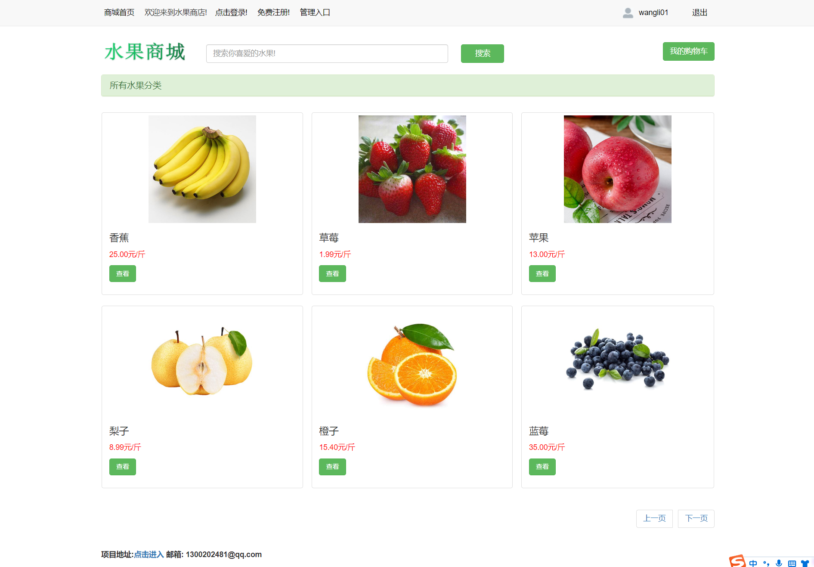
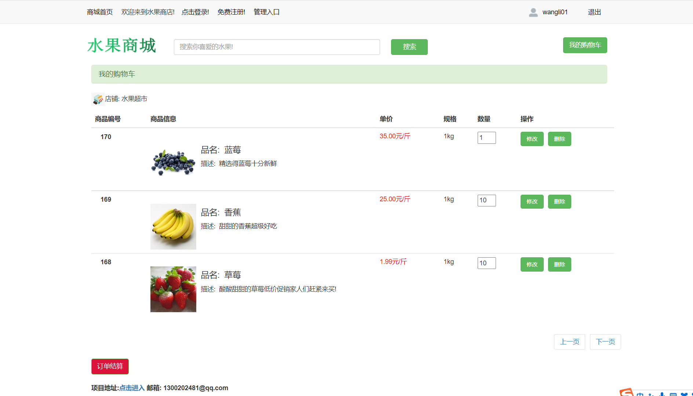
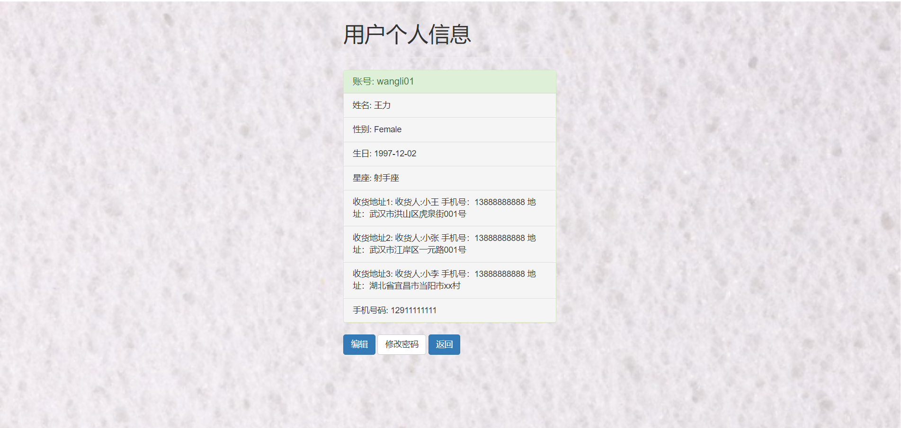

# 使用 Django + Mysql 写的简单的水果商城系统

## 1.界面截图

### （1）登录界面

###   (2) 注册用户界面

###   (3) 修改密码界面

### （4） 商城主页

### （5）商城水果列表页

### （6）商城水果详情页

### （7）商城购物车页

### （8）个人信息页

​	

### （9）确认订单页

​	

###  （10）用户管理

###  （11）权限管理

###  （12）订单管理

###  （13）商品管理

###  （14）账目管理

###  （15）退货管理

### （16）访问策略

## 2.环境配置

### （1）安装Python环境

​	windows下：

​			下载Python3.6以上版本（python.org）

​	Linux(centos8)：

​			自带python3.6.8

### （2） 安装虚拟环境并安装依赖包

​	windows下：

​			安装virtualenv模块 ：pip install virtualenv

​			创建虚拟环境文件夹：cmd中输入： virtualenv django_ENV(需要创建的虚拟环境文件夹名称)

​			激活虚拟环境: 在cmd中进入flask_ENV\Scripts目录，输入：activate即可激活虚拟环境，退出虚拟环境: deactivate

​			安装依赖包：激活虚拟环境后cd 进入项目目录，里面有一个requirements.txt依赖文件，安装只需要使用：pip install -r requirements.txt即可自动安装所有的依赖包。

Linux下：

​			创建虚拟环境：virtualenv -p python3.6 django_ENV

​			激活虚拟环境: source django_ENV/bin/activate

​			除了上述步骤与windows不一样以外其他步骤均相同。

### （3）创建表结构

windows和Linux操作相同：

​     需要手动创建对应的数据库（使用的是mysql）安装完mysql数据库之后，使用：mysql -u root -p 登录数据库，输入create database    django_database 创建名为：django_database (settings.py中的配置数据库名称为这个，也可以改为其他的，修改对应的配置即可)的数据库。然后创建表结构：使用命令：

python manage.py migrate 

python manage.py makemigrations app1

python manage.py migrate app1

创建完表结构之后，将测试数据（/testdata/django_database）导入到mysql中：

登录mysql数据库进行以下操作：

mysql -u root -p 输入密码

use django_database;

source G:\django_books\testdata\django_database.sql (windows)

或者source /django_books/testdata/django_database.sql (Linux)

创建好测试数据就可以登陆了。

## 3. 运行web应用程序

在登录前可以创建一个超级用户：python manage.py createsuperuser 输入一次用户名，邮箱，两次密码即可创建成功。

进入虚拟环境后：python manage.py runserver 0.0.0.0:5000 (ip和port可以任意指定，port不能被占用)即可运行该应用程序。目前写好的功能有：用户登录，用户注册，书本下载，书本查询，书本筛选，批量导入用户等等

## 4.使用nginx +gunicorn 部署

### （1）nginx的配置

####         安装nginx ：yum install nginx

​		（1）安装完成后查看nginx版本：nginx -v

​         （2）在/etc/nginx/nginx.conf中修改配置：vim /etc/nginx/nginx.conf    注：server中的端口为nginx的监听端口， location中的地址为gunicorn 运行django wsgi服务的地址，下面两个location为配置的静态资源地址。如果出现加载静态资源报403的情况，需要把nginx中的配置：user nginx; 改为：user root; 修改完成后按esc 冒号 输入：wq 保存退出vim。

​             (3) 重启nginx : nginx -s reload  查看nginx的服务 ：lsof -i:5000 查看到对应的进程即为配置成功 。运行nginx命令：nginx

### （2）使用gunicorn 运行服务

​			（1）安装gunicorn 包:pip install gunicorn 

​			（2）使用gunicorn 运行django项目：进入虚拟环境，项目目录，执行: gunicorn -w 4  -b 127.0.0.1:5001 BookStore.wsgi  & (-w 为进程数,-b 为绑定的host:port   BookStore为项目名称，由django-admin startproject projectname  创建， &表示后台运行)

### （3）测试结果

​              访问网页并查看接口的服务器是否为nginx，查看到Server: nginx/1.20.2表示部署成功

